<a id="prompt-toc"></a>
## 📖 案例目录

*   [案例 44：webcam滤镜游乐场 ](#prompt-44)
*   [案例 43：天气剧场 ](#prompt-43)
*   [案例 42：虚拟架子鼓 ](#prompt-42)
*   [案例 41：打字雨 ](#prompt-41)
*   [案例 40：trivia知识问答游戏 ](#prompt-40)
*   [案例 39：迷你看板 ](#prompt-39)
*   [案例 38：罗马帝国主题井字棋 ](#prompt-38)
*   [案例 37：茶叶浸泡模拟器 ](#prompt-37)
*   [案例 36：目标点击挑战 ](#prompt-36)
*   [案例 35：太阳系探索器 ](#prompt-35)
*   [案例 34：智能手表产品发布页 ](#prompt-34)
*   [案例 33：正则表达式实验室 ](#prompt-33)
*   [案例 32：番茄工作法计时器 ](#prompt-32)
*   [案例 31：播客主页 ](#prompt-31)
*   [案例 30：OpenAI.fm风格页面 ](#prompt-30)
*   [案例 29：在线白板 ](#prompt-29)
*   [案例 28：在线投票板 ](#prompt-28)
*   [案例 27：在线学院 ](#prompt-27)
*   [案例 26：海洋波浪模拟器 ](#prompt-26)
*   [案例 25：非营利组织影响力报告 ](#prompt-25)
*   [案例 24：音乐理论训练器 ](#prompt-24)
*   [案例 23：微习惯追踪器 ](#prompt-23)
*   [案例 22：数学练习训练 ](#prompt-22)
*   [案例 21：Markdown转幻灯片工具 ](#prompt-21)
*   [案例 20：语言学习抽认卡 ](#prompt-20)
*   [案例 19：动态排版工作室 ](#prompt-19)
*   [案例 18：交互式世界时钟 ](#prompt-18)
*   [案例 17：儿童节日贺卡 ](#prompt-17)
*   [案例 16：健康饮食追踪器 ](#prompt-16)
*   [案例 15：趣味障碍跳跃游戏 ](#prompt-15)
*   [案例 14：节日灯光秀 ](#prompt-14)
*   [案例 13：告别留言板 ](#prompt-13)
*   [案例 12：掉落水果捕捉游戏 ](#prompt-12)
*   [案例 11：活动反馈仪表盘 ](#prompt-11)
*   [案例 10：活动倒计时器 ](#prompt-10)
*   [案例 9：电子竞技锦标赛landing页 ](#prompt-9)
*   [案例 8：迷宫逃生游戏 ](#prompt-8)
*   [案例 7：方程求解工具 ](#prompt-7)
*   [案例 6：员工技能矩阵 ](#prompt-6)
*   [案例 5：客户旅程流程图 ](#prompt-5)
*   [案例 4：客户案例研究 ](#prompt-4)
*   [案例 3：CSV转图表工具 ](#prompt-3)
*   [案例 2：公司缩写列表 ](#prompt-2)
*   [案例 1：颜色匹配挑战游戏 ](#prompt-1)

---
<a id="prompt-44"></a>
## 案例 44：webcam滤镜游乐场
<div style="display: flex; justify-content: space-between;">
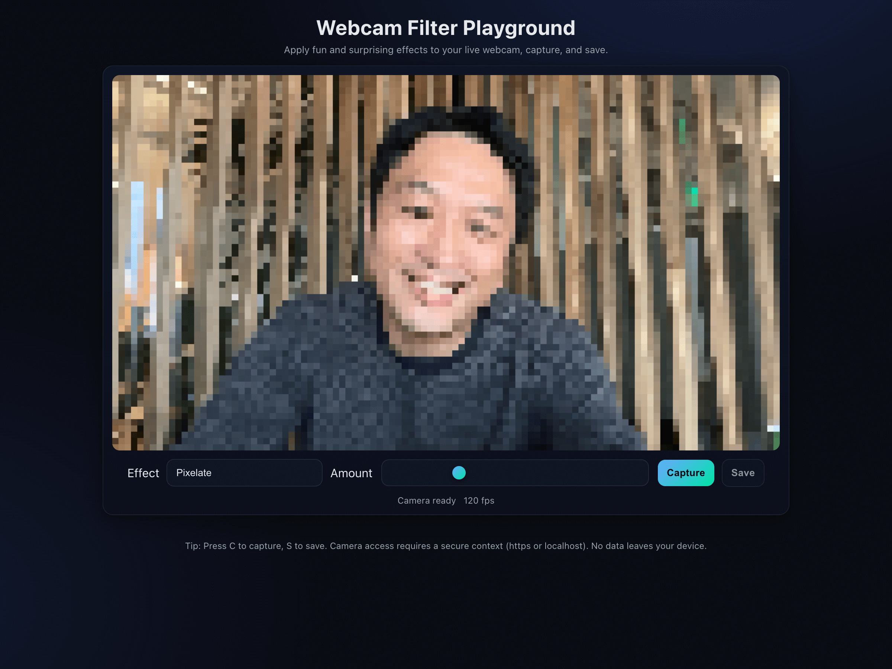
</div>

**Prompt：**
```
Create a single-page app in a single HTML file with the following requirements:
- Name: Webcam Filter Playground
- Goal: Apply fun & surprising filters to live webcam feed
- Features: Multiple effects, snapshot capture, save image.
- The UI should be minimal with a live preview.
```

<a id="prompt-43"></a>
## 案例 43：天气剧场
<div style="display: flex; justify-content: space-between;">
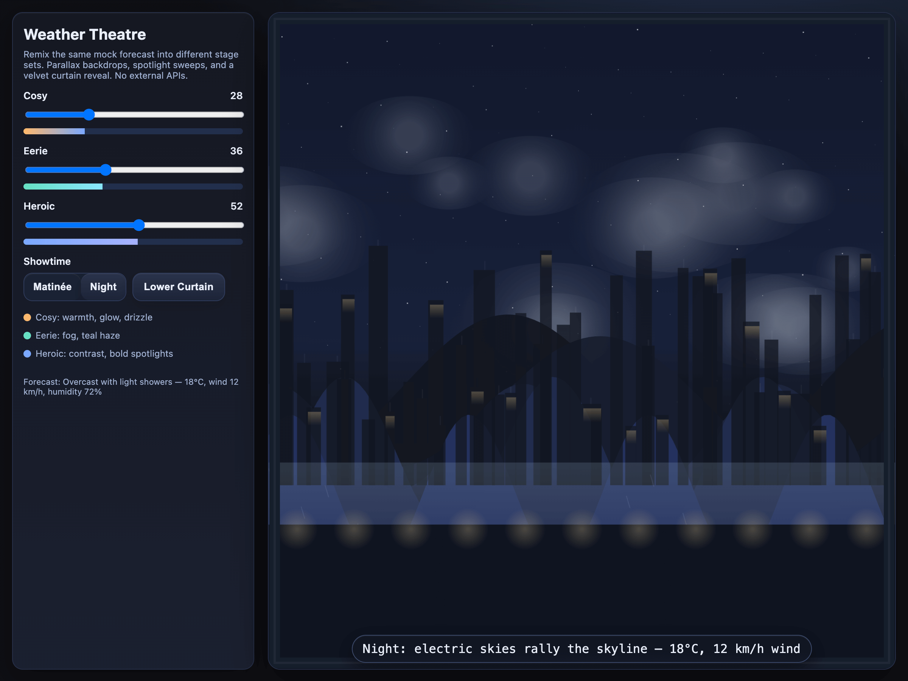
</div>

**Prompt：**
```
Generate a beautiful React + Canvas “weather theatre” where sliders (cosy, eerie, heroic) remix the same mock forecast into different stage sets; parallax backdrops, spotlight sweeps, and a curtain reveal; add a typewriter subtitle of the scene and a “Matinée/Night” toggle; no external APIs.
```

<a id="prompt-42"></a>
## 案例 42：虚拟架子鼓
<div style="display: flex; justify-content: space-between;">
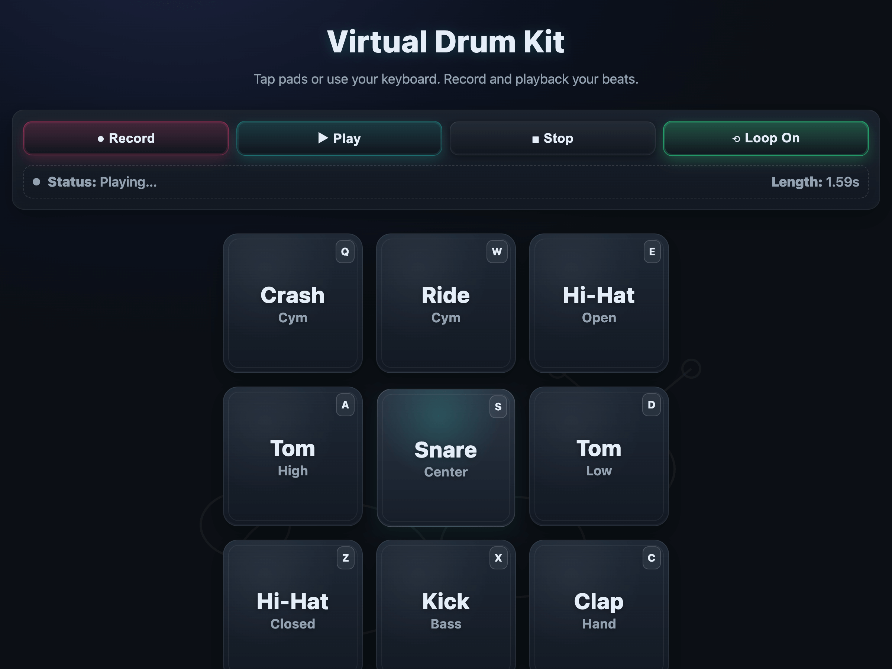
</div>

**Prompt：**
```
Create a single-page app in a single HTML file with the following requirements:
- Name: Virtual Drum Kit
- Goal: Play a drum kit using keyboard or clicks.
- Features: Multiple drum sounds, record and playback mode.
- The UI should be music-studio themed & drum set featured; the pads should be large enough to tap on mobile.
```

<a id="prompt-41"></a>
## 案例 41：打字雨
<div style="display: flex; justify-content: space-between;">
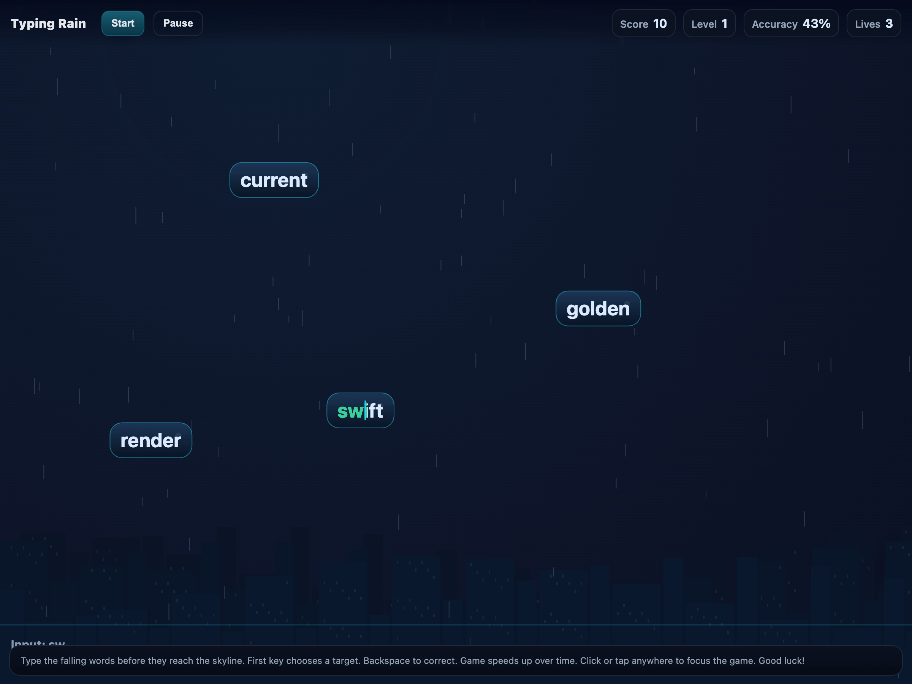
</div>

**Prompt：**
```
Create a single-page app in a single HTML file with the following requirements:
- Name: Typing Rain
- Goal: Type falling words before they reach the bottom.
- Features: Increasing difficulty, accuracy tracker, score.
- The UI should be the city background with animated raindrop words.
```

<a id="prompt-40"></a>
## 案例 40：trivia知识问答游戏
<div style="display: flex; justify-content: space-between;">
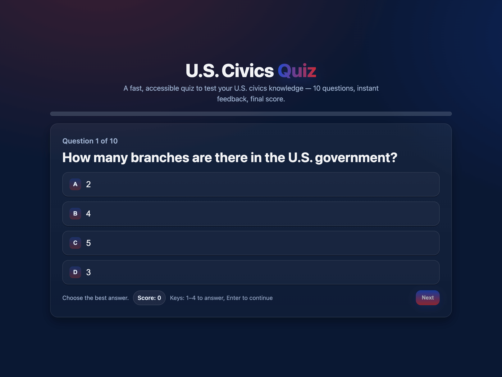
</div>

**Prompt：**
```
Create a single-page app in a single HTML file that hosts a themed trivia quiz.
- Inputs: question text, multiple-choice answers, correct answer.
- Show one question at a time with card-style layout, large readable text, and animated feedback (green check or red X).
- Include a progress bar at the top and final score display at the end.
- Create 10 built-in quiz and display them randomly; the quiz must be basic level for US citizens
```

<a id="prompt-39"></a>
## 案例 39：迷你看板
<div style="display: flex; justify-content: space-between;">
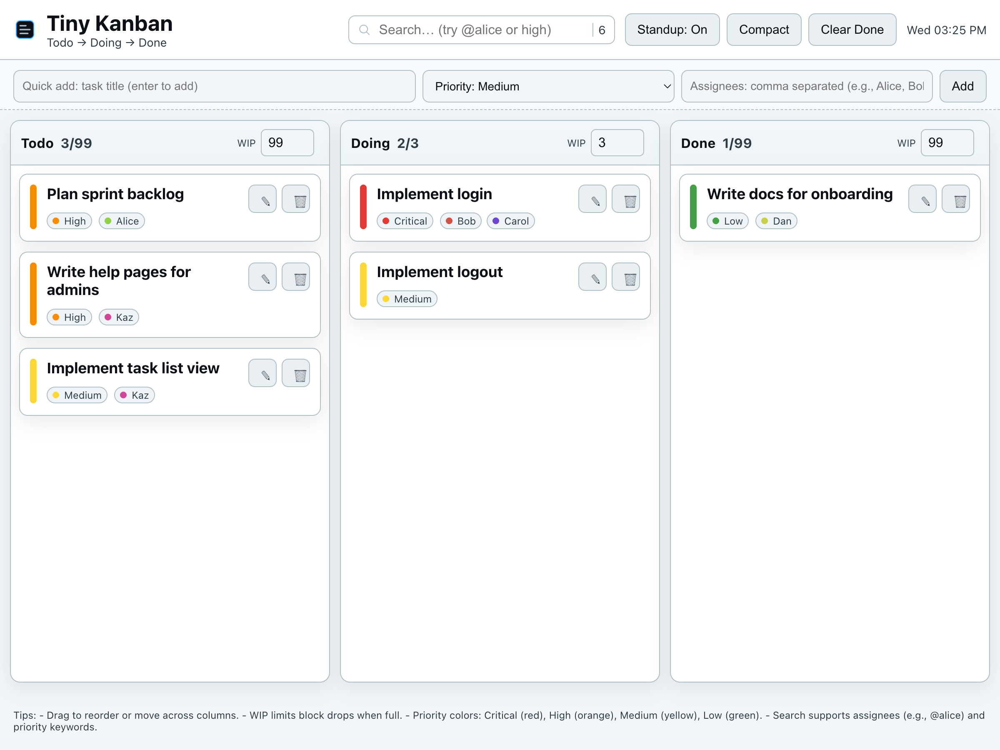
</div>

**Prompt：**
```
Create a single-page app in a single HTML file with the following requirements:
- Name: Tiny Kanban
- Goal: Enable Todo → Doing → Done workflow.
- Features: Drag cards, WIP limits, priority colors, assign to people, search filter, delete items.
- The UI, font size, and colors etc. should be suitable for daily standup meetings.
```

<a id="prompt-38"></a>
## 案例 38：罗马帝国主题井字棋
<div style="display: flex; justify-content: space-between;">
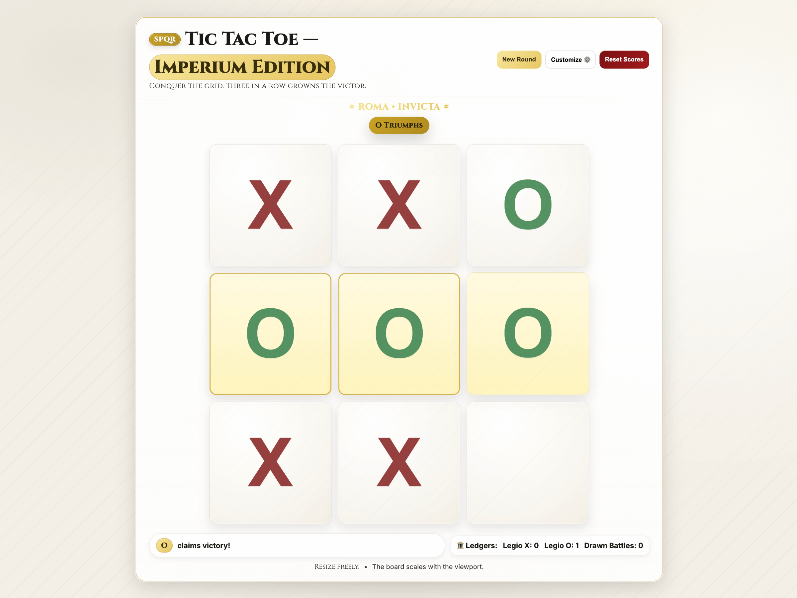
</div>

**Prompt：**
```
Create a single-page app, in a single HTML file:
a Tic Tac Toe game that is Roman Empire themed, fully responsive, and modern.

Requirements:
- Full-viewport, fluid board (vmin-based) and mobile/desktop responsive layout.
- Roman theme: marble background, gold accents, SPQR crest, subtle Colosseum vibe.
- Clean top bar with only three buttons: “New Round”, “Customize”, “Reset Scores”.
- Put all options in a “Customize” dialog:
  • Theme: Marble Day / Night Legion
  • Glyphs: Standard X/O or Gladius/Laurel
  • Mode: 2-player or vs AI
  • First move: X or O
  • AI discipline: Perfect / Pragmatic / Reckless
- Game logic:
  • Perfect-play AI via minimax with difficulty handicaps
  • Scoreboard for X, O, and Draws
  • Gold win highlight + non-overlapping victory banner under header
  • Canvas-based confetti on win (no DOM node spraying), respects prefers-reduced-motion
- Accessibility: ARIA roles for grid/cells, live status updates, keyboard + touch support.
- Visuals: smooth hover/press states, soft shadows, rounded corners, scalable typography.
- Constraints: no element overlap or flashing; no external JS frameworks; one HTML file with inline CSS/JS (Google Fonts allowed).
```

<a id="prompt-37"></a>
## 案例 37：茶叶浸泡模拟器
<div style="display: flex; justify-content: space-between;">
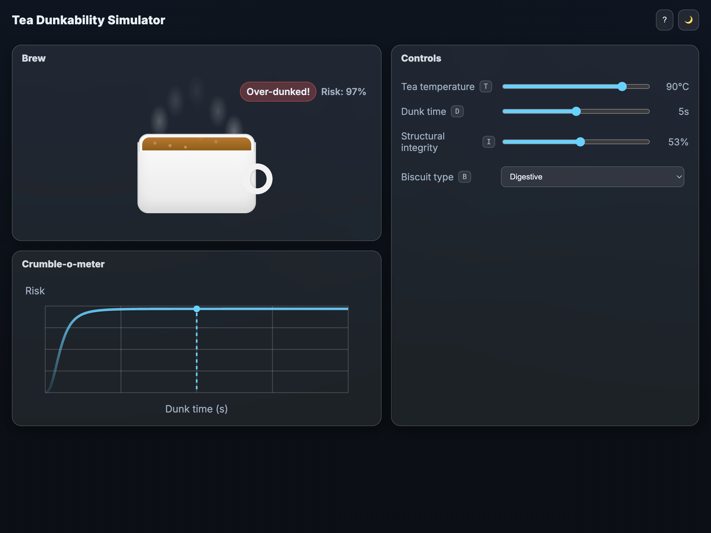
</div>

**Prompt：**
```
Generate a React page that simulates tea dunkability for classic biscuits: sliders for tea temp, dunk time, biscuit type, and structural integrity; animate a looping teacup with steam, show a crumble-o-meter graph, and sprinkle crumbs on over-dunks; glass cards, dark mode, and keyboard shortcuts
```

<a id="prompt-36"></a>
## 案例 36：目标点击挑战
<div style="display: flex; justify-content: space-between;">
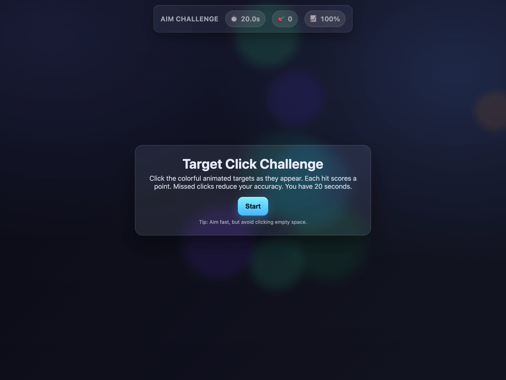
</div>

**Prompt：**
```
Create a single-page app in a single HTML file for a target clicking challenge.
- Random targets appear briefly around the screen — click them to score.
- Game runs for 20 seconds; show score and accuracy at the end.
- Use colorful animated targets and a modern scoreboard overlay. The background should be a light color.
```

<a id="prompt-35"></a>
## 案例 35：太阳系探索器
<div style="display: flex; justify-content: space-between;">
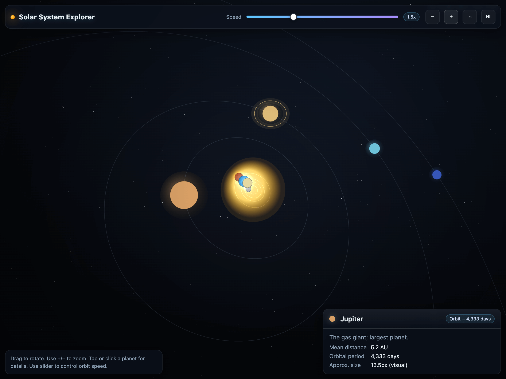
</div>

**Prompt：**
```
Create a single-page app in a single HTML file with the following requirements:
- Name: Solar System Explorer
- Goal: Visualize planets orbiting the sun.
- Features: Click planets for info, orbit speed control, and, drag to rotate, zoom in/out.
- The UI should be dark-themed and interactive.
```

<a id="prompt-34"></a>
## 案例 34：智能手表产品发布页
<div style="display: flex; justify-content: space-between;">
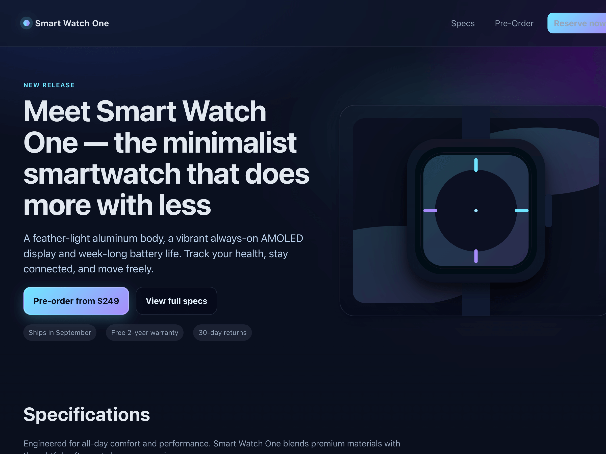
</div>

**Prompt：**
```
Create a single-page app in a single HTML file with the following requirements:
- Name: Product Press Release
- Goal: Showcase a new physical or digital product.
- Features: Large hero image, specs section, pre-order form.
- The UI should be modern and product-centric.
```

<a id="prompt-33"></a>
## 案例 33：正则表达式实验室
<div style="display: flex; justify-content: space-between;">
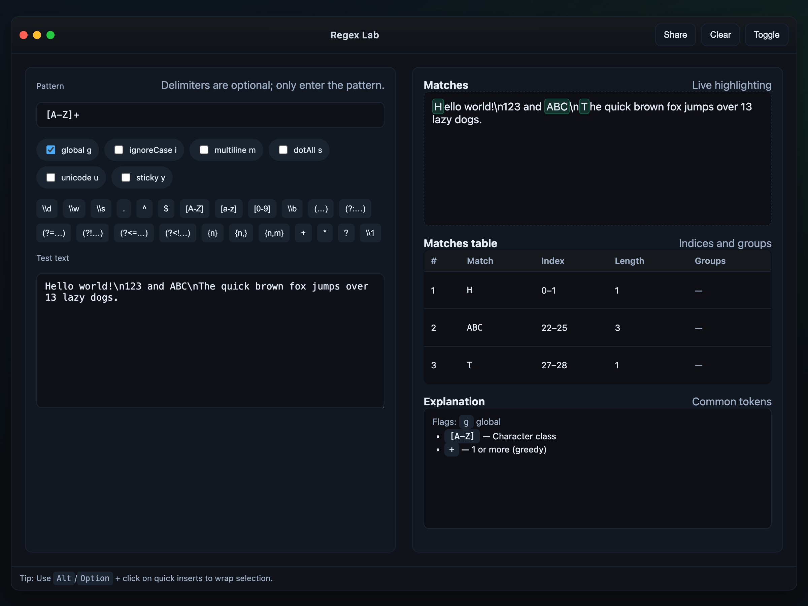
</div>

**Prompt：**
```
Build a single-file regex playground (index.html) with no bundler that helps users learn and test regular expressions:
- Inputs: pattern, flags (g i m s u y), and test text area with live updates
- Output panes: highlighted matches with group colors, table of matches with indices and capture groups, and an explanation of the pattern using common tokens
- Utilities: quick inserts for common tokens (\\d, \\w, \\s, [A-Z], lookahead, etc.), copy/share permalink with pattern+flags encoded in URL hash
- Error handling: graceful feedback for invalid patterns, show error message and caret position
- UX: terminal-window style, light/dark toggle (default to dark), clear button
```

<a id="prompt-32"></a>
## 案例 32：番茄工作法计时器
<div style="display: flex; justify-content: space-between;">
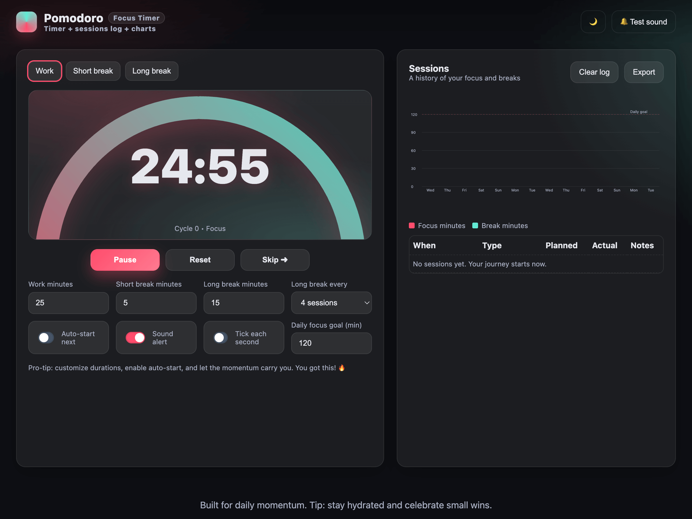
</div>

**Prompt：**
```
Create a single-page app in a single HTML file with following requirements:
- Name: Pomodoro
- Goal: Timer + sessions log.
- Features: Custom durations, auto-start option, session charts (SVG), sound alert (beep), dark mode.
- The UI should be good for daily-use and give some energy to the user!
```

<a id="prompt-31"></a>
## 案例 31：播客主页
<div style="display: flex; justify-content: space-between;">
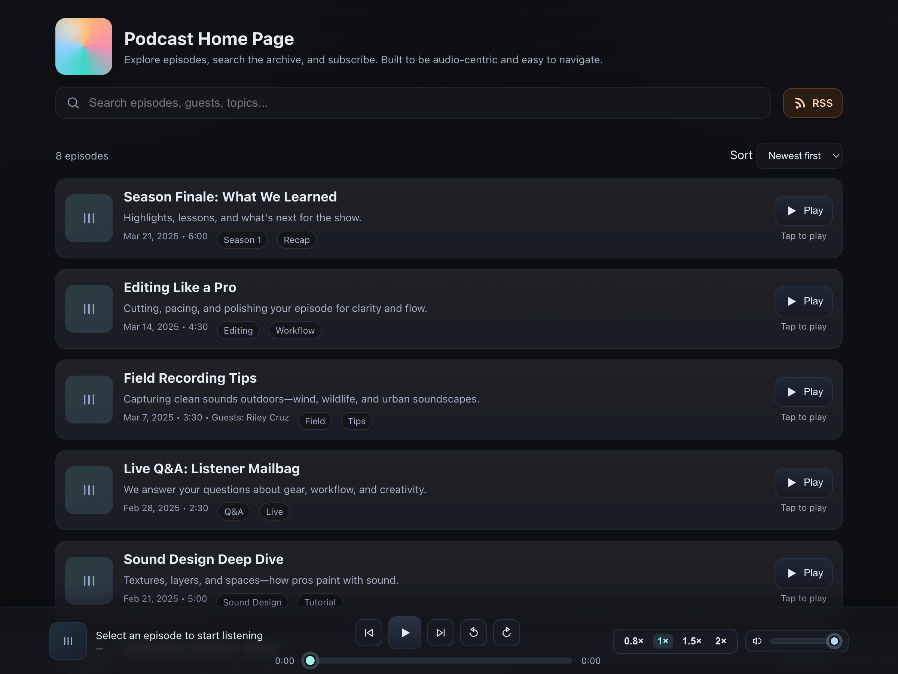
</div>

**Prompt：**
```
Create a single-page app in a single HTML file with the following requirements:
- Name: Podcast Home Page
- Goal: Display all podcast episodes.
- Features: Episode list, search, subscribe buttons.
- The UI should be audio-centric and easy to navigate.
```

<a id="prompt-30"></a>
## 案例 30：OpenAI.fm风格页面
<div style="display: flex; justify-content: space-between;">
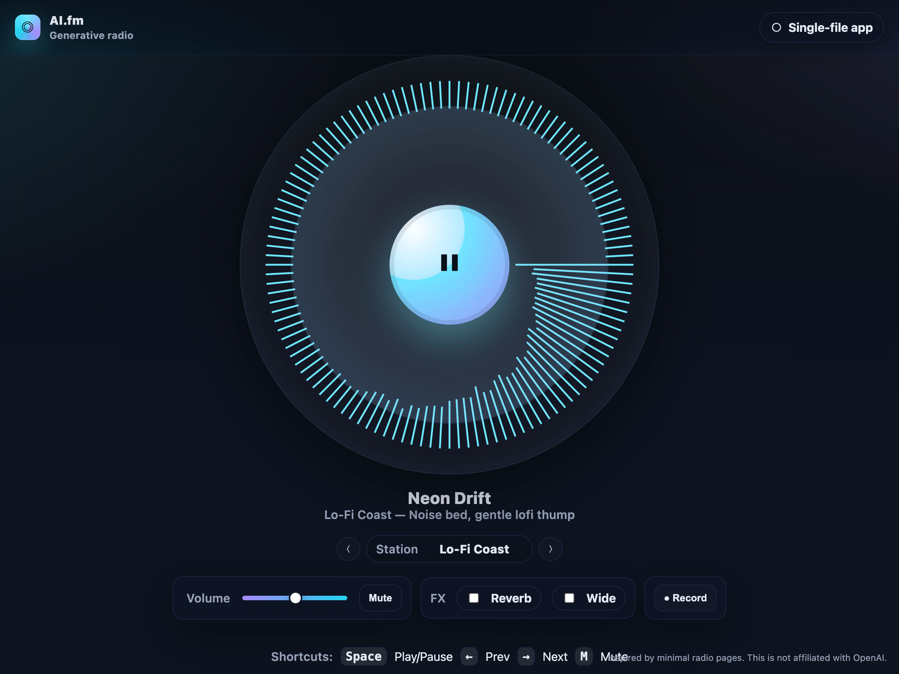
</div>

**Prompt：**
```
Create a single-page app in a single HTML file that is inspired by https://openai.fm/
```

<a id="prompt-29"></a>
## 案例 29：在线白板
<div style="display: flex; justify-content: space-between;">
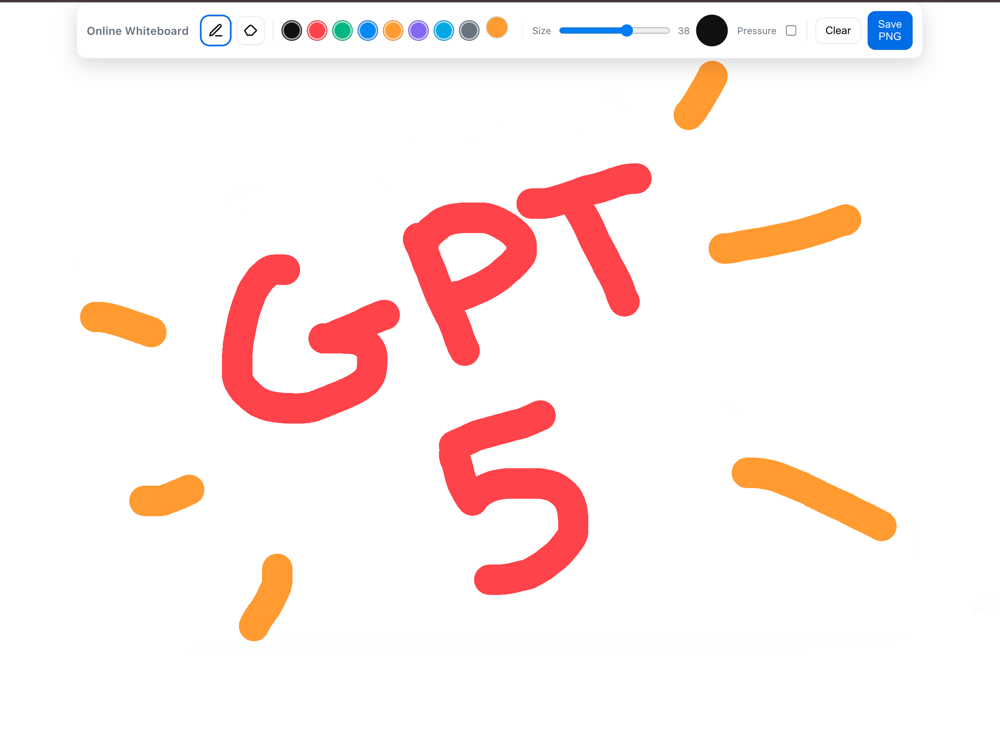
</div>

**Prompt：**
```
Create a single-page app in a single HTML file with the following requirements:
- Name: Online Whiteboard
- Goal: Draw and collaborate visually (local-only).
- Features: Drawing tools, erase, save image.
- The UI should be simple and full-screen.
```

<a id="prompt-28"></a>
## 案例 28：在线投票板
<div style="display: flex; justify-content: space-between;">
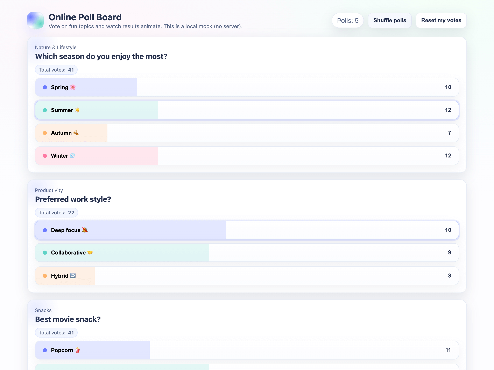
</div>

**Prompt：**
```
Create a single-page app in a single HTML file with the following requirements:
- Name: Online Poll Board
- Goal: Let visitors vote on topics (mock).
- Features: List of polls, vote count animations, results display.
- The UI should be engaging and easy to use; the background should be a light delightful color.
```

<a id="prompt-27"></a>
## 案例 27：在线学院
<div style="display: flex; justify-content: space-between;">
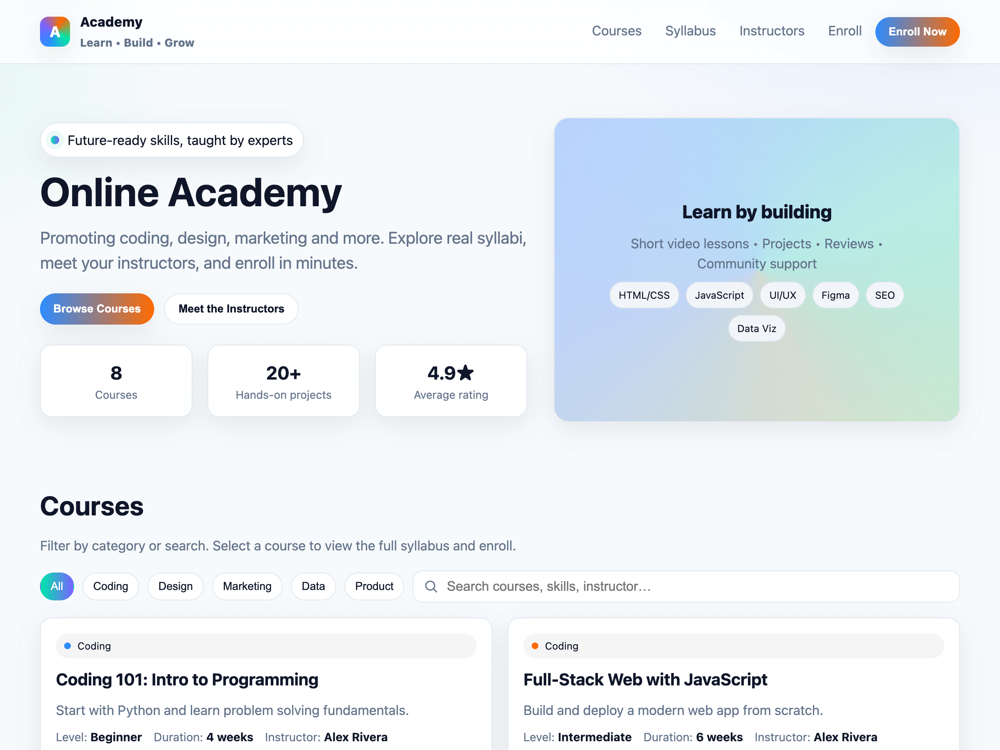
</div>

**Prompt：**
```
Create a single-page app in a single HTML file with the following requirements:
- Name: Online Academy
- Goal: Promote a variety of online courses; coding, design, marketing, etc.
- Features: Course syllabus, instructor bio, enrollment form.
- The UI should be learning-focused with bright accents.
```

<a id="prompt-26"></a>
## 案例 26：海洋波浪模拟器
<div style="display: flex; justify-content: space-between;">
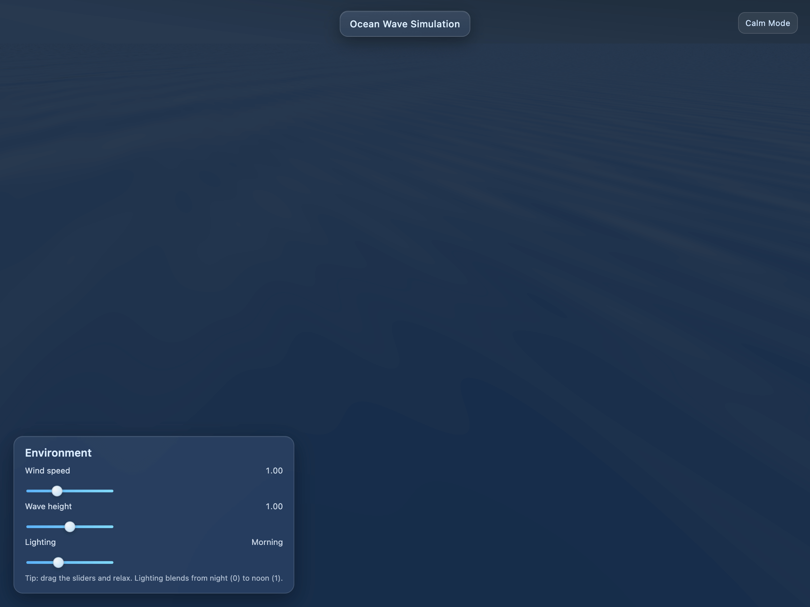
</div>

**Prompt：**
```
Create a single-page app in a single HTML file with the following requirements:
- Name: Ocean Wave Simulation
- Goal: Display realistic animated waves.
- Features: Change wind speed, wave height, lighting.
- The UI should be calming and realistic.
```

<a id="prompt-25"></a>
## 案例 25：非营利组织影响力报告
<div style="display: flex; justify-content: space-between;">
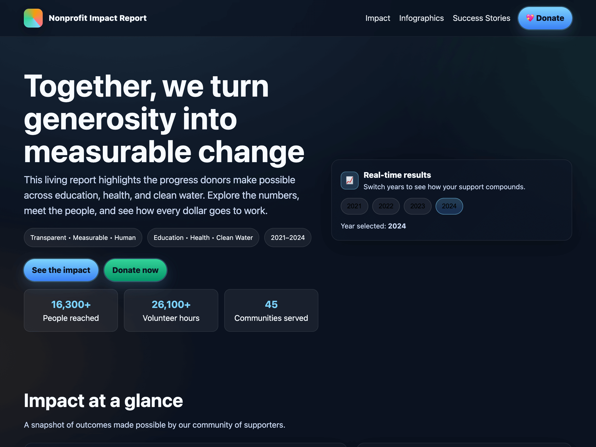
</div>

**Prompt：**
```
Create a single-page app in a single HTML file with the following requirements:
- Name: Nonprofit Impact Report
- Goal: Show measurable results of programs.
- Features: Infographics, success stories, donation link.
- The UI should be inspiring and visually engaging.
```

<a id="prompt-24"></a>
## 案例 24：音乐理论训练器
<div style="display: flex; justify-content: space-between;">
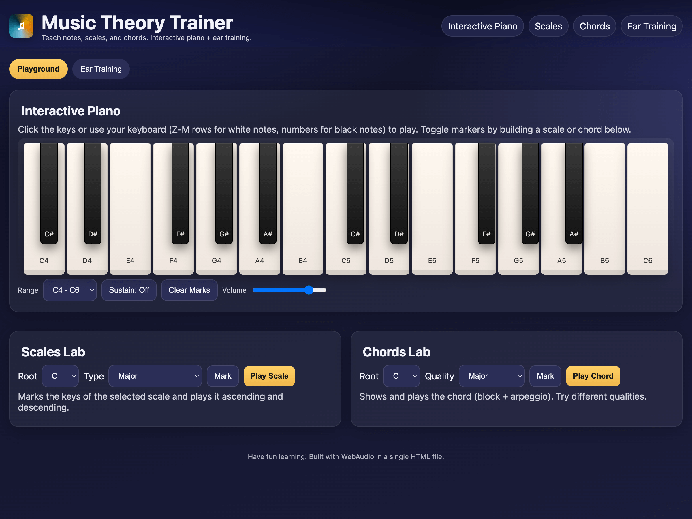
</div>

**Prompt：**
```
Create a single-page app in a single HTML file with the following requirements:
- Name: Music Theory Trainer
- Goal: Teach notes, scales, and chords.
- Features: Interactive piano, ear training exercises.
- The UI should be music-themed, interactive, and fun.
```

<a id="prompt-23"></a>
## 案例 23：微习惯追踪器
<div style="display: flex; justify-content: space-between;">
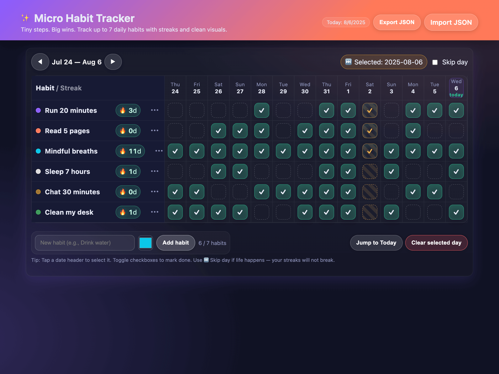
</div>

**Prompt：**
```
Create a single-page app in a single HTML file with the following requirements:
- Name: Micro Habit Tracker
- Goal: Track up to 7 daily habits with streaks and simple charts.
- Features: Add, edit, and delete habits; daily checkmarks; streak counter; "Skip day" option; export/import JSON.
- The design should be concise and simple for daily use, but it should inspire and energize the user
- Must be compatible with both laptop and mobile screens
- For demo purposes, include a few days of example data by default.
```

<a id="prompt-22"></a>
## 案例 22：数学练习训练
<div style="display: flex; justify-content: space-between;">
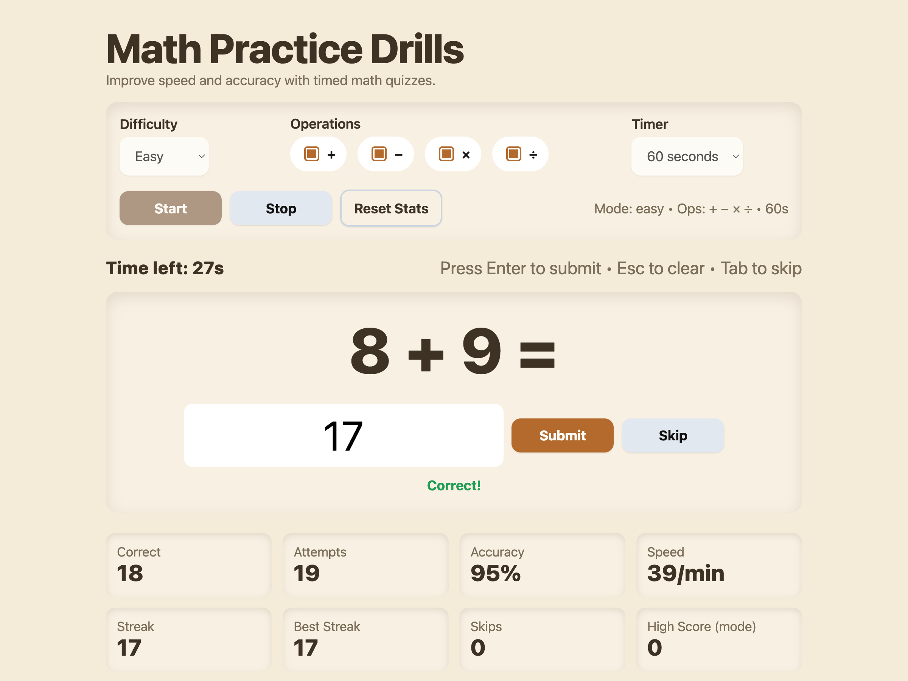
</div>

**Prompt：**
```
Create a single-page app in a single HTML file with the following requirements:
- Name: Math Practice Drills
- Goal: Improve speed and accuracy with math problems.
- Features: Timed quizzes, difficulty settings, score tracker.
- The UI should be minimal with large, readable text.
```

<a id="prompt-21"></a>
## 案例 21：Markdown转幻灯片工具
<div style="display: flex; justify-content: space-between;">
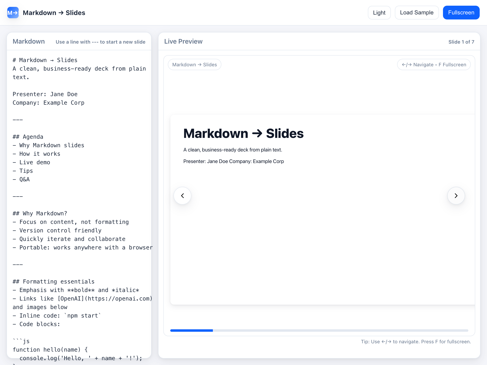
</div>

**Prompt：**
```
Create a single-page app in a single HTML file with following requirements:
- Name: Markdown → Slides
- Goal: Convert markdown (--- as slide breaks) to deck.
- Features: Live preview with full-screen button, keyboard nav, theme toggle, sample deck loader.
- The outlook must be sophisticated and suitable for business presentation
- For demo purpose, an example markdown text should be filled in the text box
```

<a id="prompt-20"></a>
## 案例 20：语言学习抽认卡
<div style="display: flex; justify-content: space-between;">
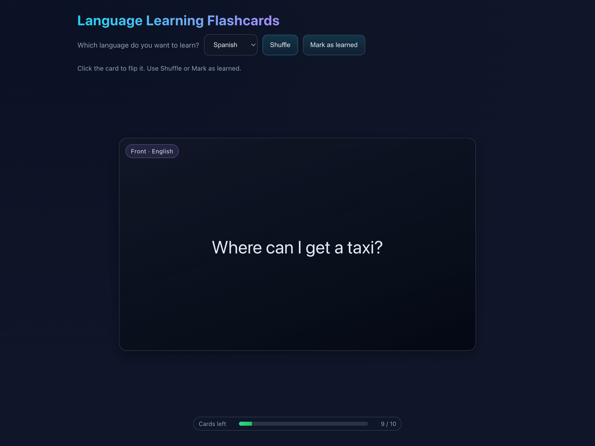
</div>

**Prompt：**
```
Create a single-page app in a single HTML file for interactive language flashcards.
- Ask a visitor which language they want to learn (English, Spanish, French, or Japanese)
- Consider visitor's locale to translate the UI by default
- Display cards with flip animations to reveal the translation on the back.
- Create 10 built-in questions for each language; these ten should be useful phrases when traveling.
- Include a “shuffle” and “mark as learned” function with smooth animations.
```

<a id="prompt-19"></a>
## 案例 19：动态排版工作室
<div style="display: flex; justify-content: space-between;">
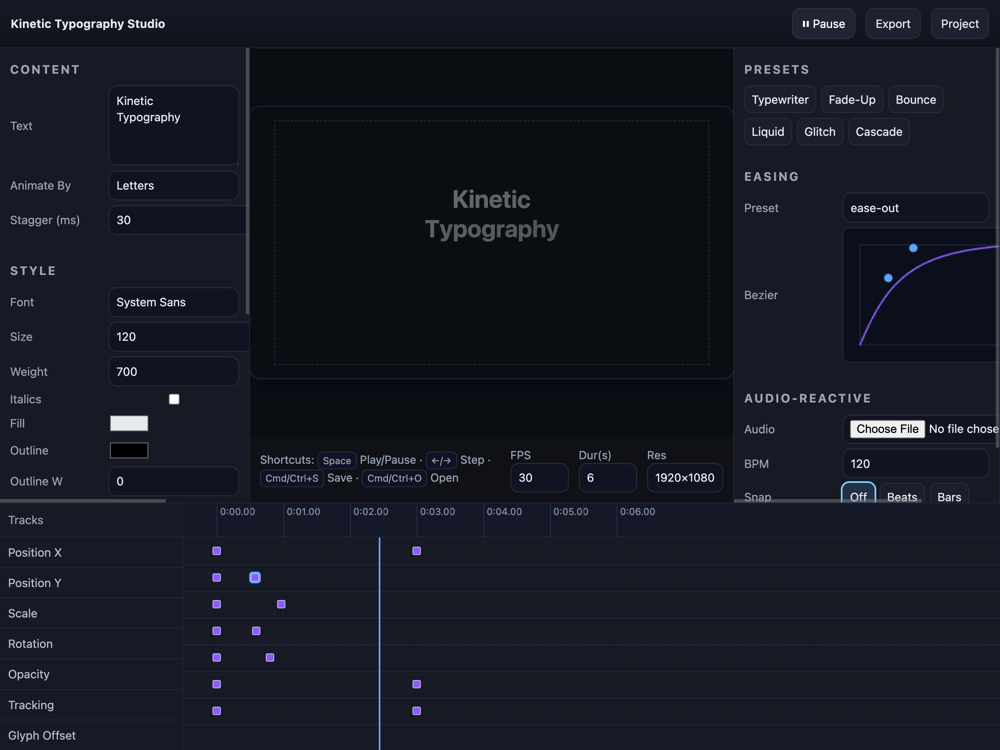
</div>

**Prompt：**
```
Title: Kinetic Typography Studio
Prompt:
Create a single-page app, in a single HTML file, that lets users design and export animated text sequences.
Timeline editor with keyframes for position, scale, rotation, opacity, letter/word offsets, and tracking; easing curves with presets and custom Bézier.
Animation presets: typewriter, bounce, liquid, glitch, fade-up, cascade by word/letter/line; per-glyph stagger controls.
Audio-reactive mode: load a local audio file, auto-detect beats, and snap keyframes to bars/beats; live preview with scrub.
Style controls: font picker (system + a few bundled web fonts), weight, italics, fill/outline, gradients, shadows, motion blur toggle, background color or image.
Layout tools: safe-area guides, 1:1/9:16/16:9 aspect presets, margins, grid.
Export: MP4/WebM/GIF or PNG sequence; include frame rate and resolution options; render without UI chrome.
Accessibility: keyboard shortcuts, focus order, ARIA labels on controls; “prefers-reduced-motion” reduces heavy effects.
Responsive, touch + mouse support; no external APIs.
```

<a id="prompt-18"></a>
## 案例 18：交互式世界时钟
<div style="display: flex; justify-content: space-between;">
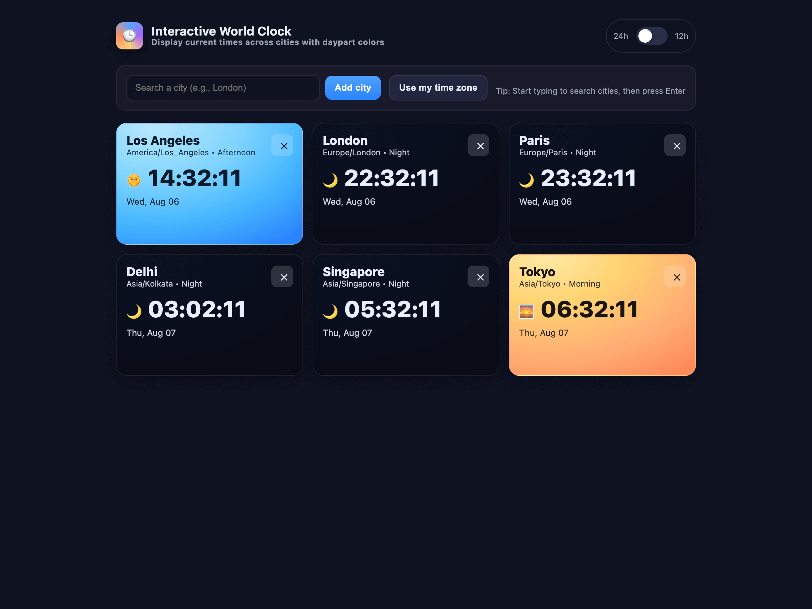
</div>

**Prompt：**
```
Create a single-page app in a single HTML file with the following requirements:
- Name: Interactive World Clock
- Goal: Display current times in multiple cities.
- Features: Add/remove cities, 12/24h toggle.
- The UI should be time-focused; each city should reflect morning/afternoon/evening/night time using colors and icons.
```

<a id="prompt-17"></a>
## 案例 17：儿童节日贺卡
<div style="display: flex; justify-content: space-between;">
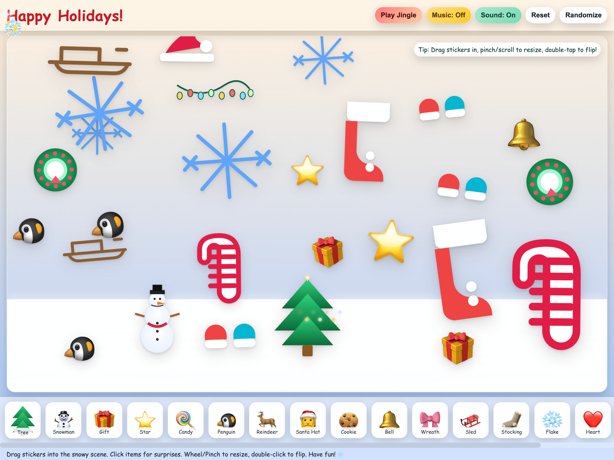
</div>

**Prompt：**
```
Create a single-page app, in a single HTML file, that demonstrates a warm and fun holiday card! The card should be interactive and enjoyable for kids!
- Have variety of items kids can drop in the UI; a few should be already placed by default
- Also have fun sound interactions
- Place many cute and fun stuff as much as possible
- Animation like snowdrop should be used nicely
```

<a id="prompt-16"></a>
## 案例 16：健康饮食追踪器
<div style="display: flex; justify-content: space-between;">
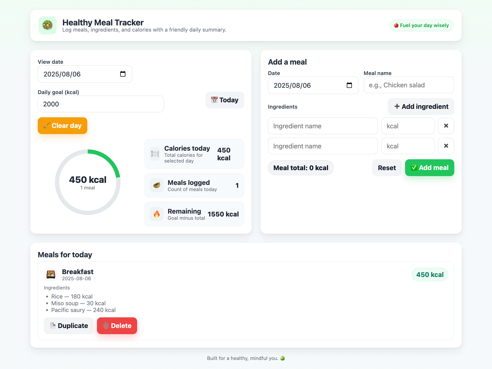
</div>

**Prompt：**
```
Create a single-page app in a single HTML file with the following requirements:
- Name: Healthy Meal Tracker
- Goal: Log meals and nutrition info.
- Features: Ingredient list, calories per meal, daily summary.
- The UI should be clean with food icons.
```

<a id="prompt-15"></a>
## 案例 15：趣味障碍跳跃游戏
<div style="display: flex; justify-content: space-between;">
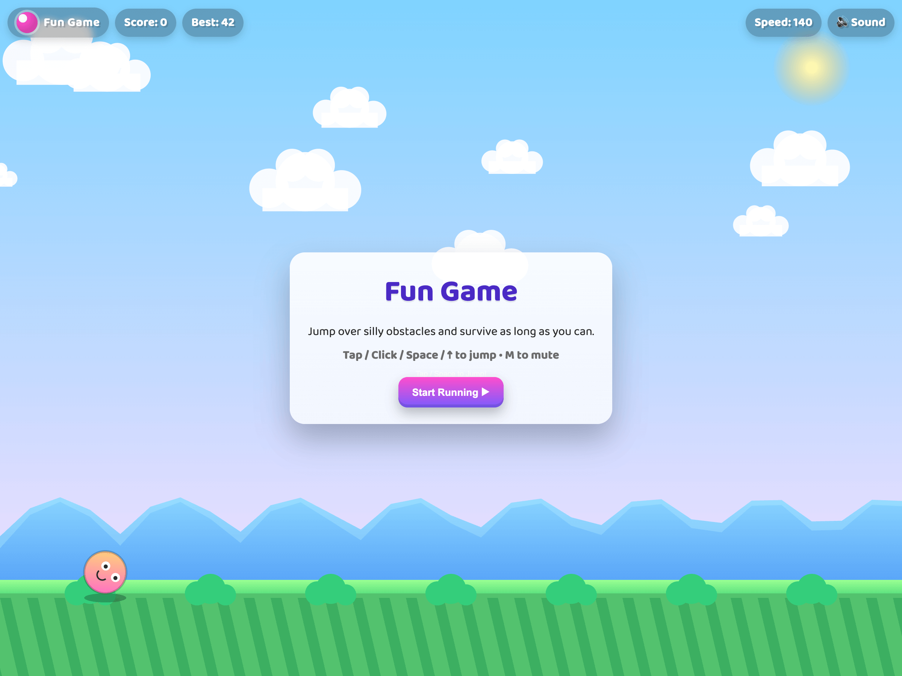
</div>

**Prompt：**
```
Create a single-page app in a single HTML file with the following requirements:
- Name: Fun Game
- Goal: Jump over obstacles to survive as long as possible.
- Features: Increasing speed, high score tracking, retry button, and funny sounds for actions and events.
- The UI should be colorful, with parallax scrolling backgrounds.
- The characters should look cartoonish and be fun to watch.
- The game should be enjoyable for everyone.
```

<a id="prompt-14"></a>
## 案例 14：节日灯光秀
<div style="display: flex; justify-content: space-between;">
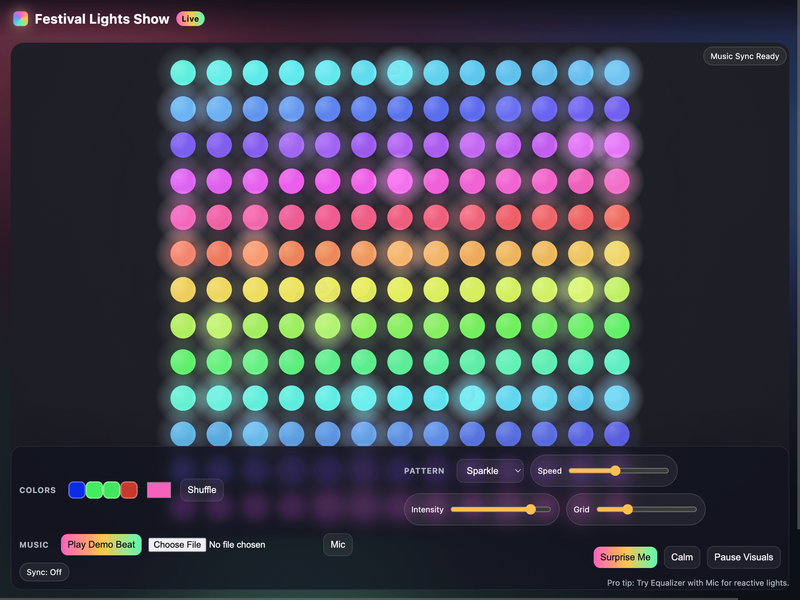
</div>

**Prompt：**
```
Create a single-page app in a single HTML file with the following requirements:
- Name: Festival Lights Show
- Goal: Control a virtual light show.
- Features: Color changes, patterns, music sync.
- The UI should be vibrant and dynamic.
```

<a id="prompt-13"></a>
## 案例 13：告别留言板
<div style="display: flex; justify-content: space-between;">
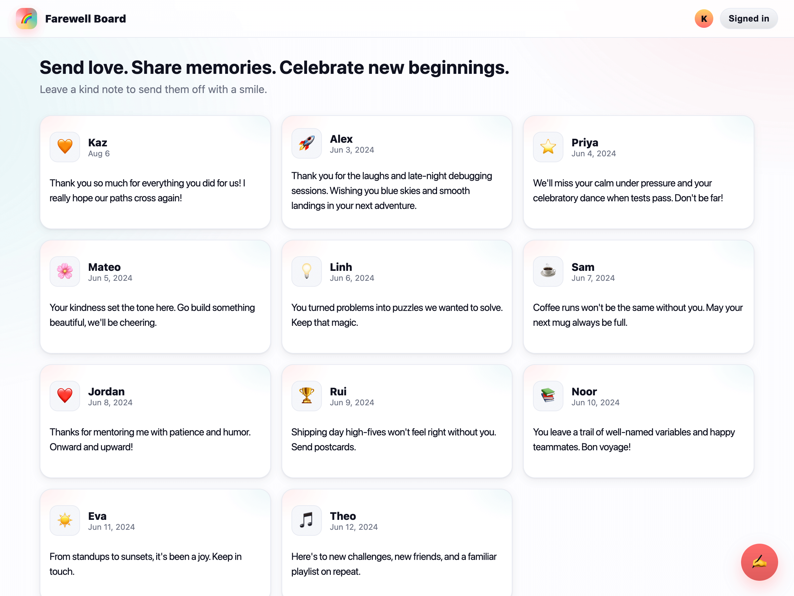
</div>

**Prompt：**
```
Create a single-page app, in a single HTML file, for a farewell message board with a warm and fun feeling:
- Use the latest UI components to give the site a professional appearance.
- Display 10 pre-posted messages nicely as heartfelt cards, each with a meaningful picture. If a message includes pictures, be sure the text remains the main focus.
- Include a \"Write\" button that allows users to add new messages.
- Add a pseudo login button at the top.
- Ensure UI design policies, such as button sizes, are consistent throughout.
```

<a id="prompt-12"></a>
## 案例 12：掉落水果捕捉游戏
<div style="display: flex; justify-content: space-between;">
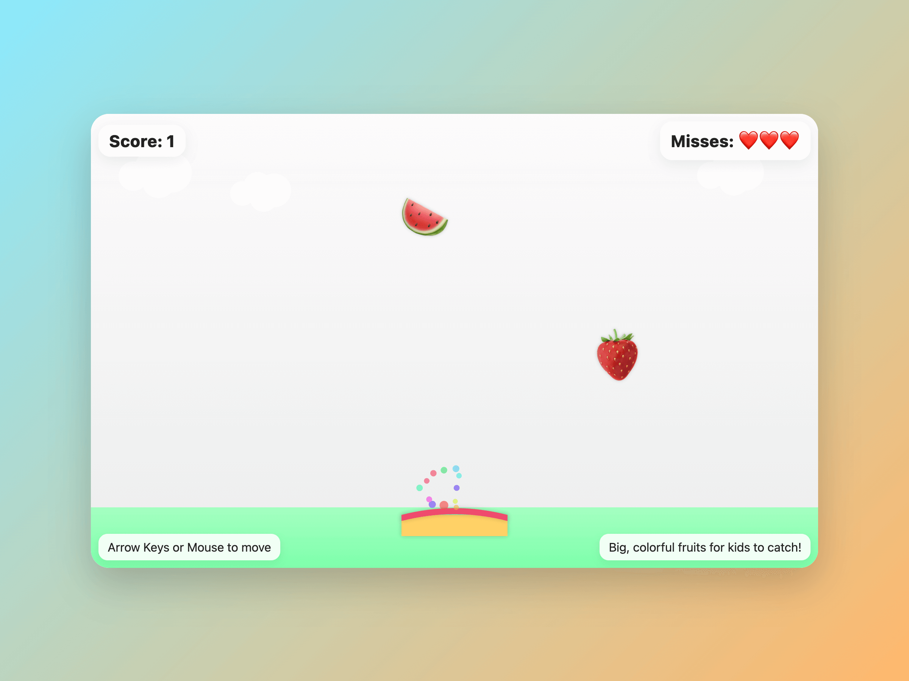
</div>

**Prompt：**
```
Create a single-page app in a single HTML file for a falling objects game.
- Player controls a basket at the bottom (arrow keys or mouse) to catch falling fruits.
- Score increases with each catch; missing 3 ends the game.
- Use bright, playful colors, smooth animations, and clear score display.
- The falling objects should be large enough for kids
```

<a id="prompt-11"></a>
## 案例 11：活动反馈仪表盘
<div style="display: flex; justify-content: space-between;">
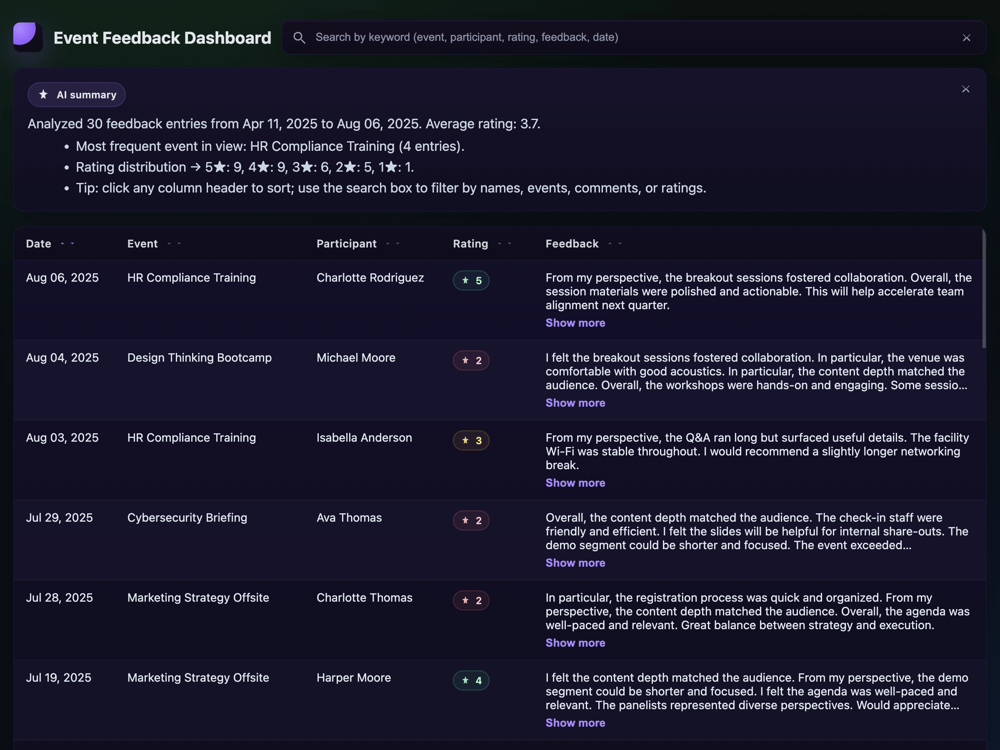
</div>

**Prompt：**
```
Create a single-page app in a single HTML file that provides the following features using modern, user-friendly web frontend components suitable for business users:
- Display a large table view listing all database rows. The data includes event participant feedback submissions with columns for date, event name, participant name, rating, and feedback.
- Feedback should be a bit long, but the table should nicely display it as well
- Add a search bar at the top that allows users to filter entries by keyword.
- Place an "AI summary" section at the top with a close button.
- Populate the table with a realistic, randomly generated dataset containing 30 entries.
- Enable users to sort the table by clicking on a column header; the table should reorder the rows in ascending or descending order, with icons indicating the current sort direction.
- Pay attention to details: ensure the layout and UI remain intact, colors are used effectively (a monotone business palette is safe, but feel free to be creative!), and no part of the interface appears broken.
```

<a id="prompt-10"></a>
## 案例 10：活动倒计时器
<div style="display: flex; justify-content: space-between;">
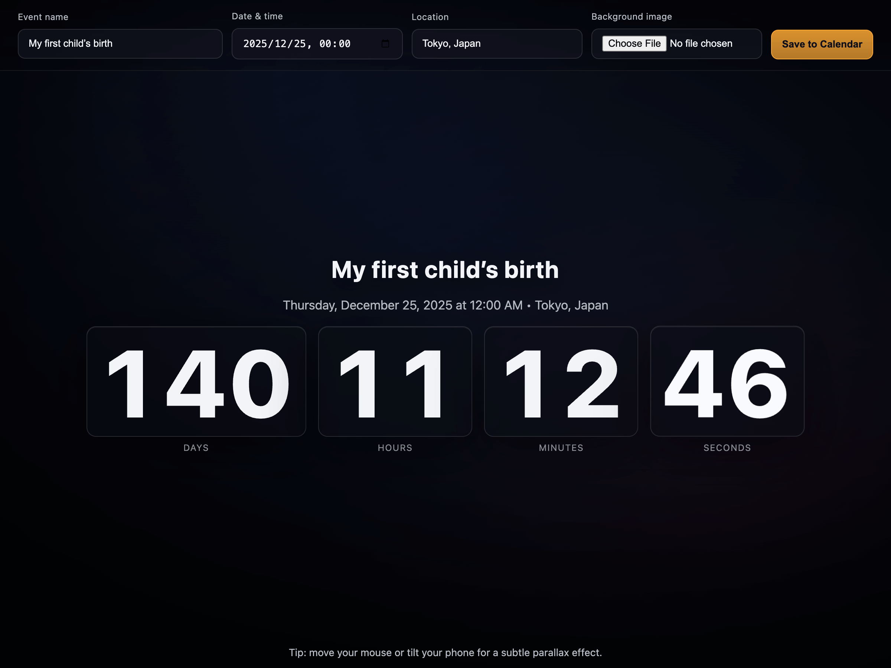
</div>

**Prompt：**
```
Create a single-page app in a single HTML file that builds a live event countdown.
- Inputs: event name, date/time, location, background image upload.
- Display large animated countdown numbers, subtle background parallax effect, and a “Save to Calendar” button.
```

<a id="prompt-9"></a>
## 案例 9：电子竞技锦标赛 landing页
<div style="display: flex; justify-content: space-between;">
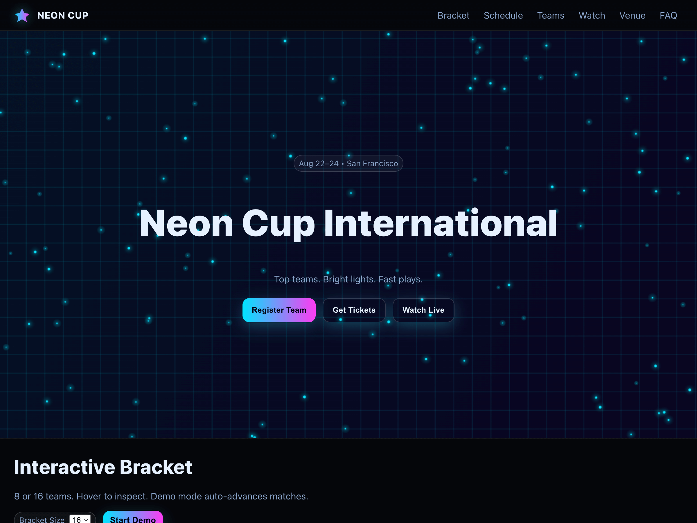
</div>

**Prompt：**
```
Title: Esports Tournament
Prompt:
Create a single-page app, in a single HTML file, for a neon, high-contrast esports tournament landing page.
Hero: animated 3D/Canvas backdrop with subtle scanlines; bold headline, date, and CTA buttons (“Register Team”, “Get Tickets”, “Watch Live”).
Interactive bracket: 8/16-team bracket with hover states, team logos, and match times; auto-advance demo mode.
Schedule section: timezone-aware match list with filters (stage, day) and an “Add to calendar” button (ICS export).
Team cards: roster, roles, country flags, recent form; responsive grid with quick compare.
Stream preview: embedded placeholder player with “Now/Next” ticker and sponsor carousel.
Venue & travel: map image, directions links, hotels list; accessibility and safety notes.
Social proof: testimonials, follower counts, and recent highlights carousel.  
Footer: FAQs, rules PDF link, code of conduct, contact form; sticky “Buy Tickets” CTA on mobile.  
Performance: lazy-loaded images, prefers-reduced-motion support; clean, modern, fully responsive.
```

<a id="prompt-8"></a>
## 案例 8：迷宫逃生游戏
<div style="display: flex; justify-content: space-between;">
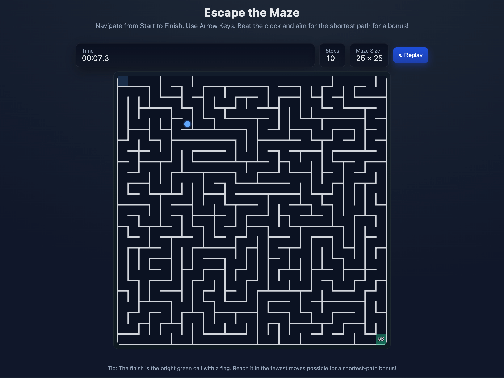
</div>

**Prompt：**
```
Create a single-page app in a single HTML file with following requirements:
- Name: Escape the Maze
- Goal: Navigate from start to finish in a randomly generated maze.
- Features: Arrow key controls, timer, shortest path bonus, replay button.
- The UI should be clear with visible maze walls and a movable avatar.
```

<a id="prompt-7"></a>
## 案例 7：方程求解工具
<div style="display: flex; justify-content: space-between;">
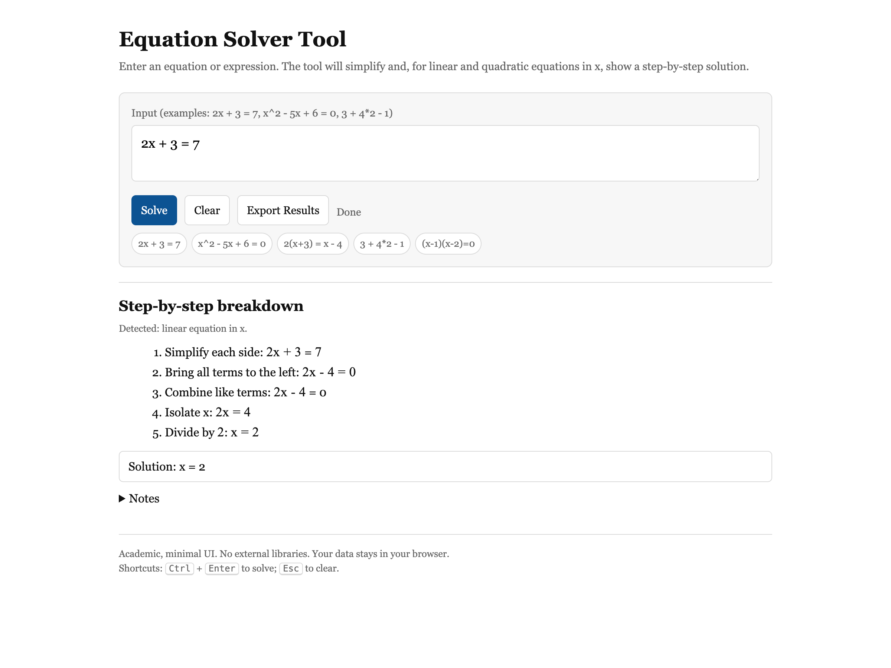
</div>

**Prompt：**
```
Create a single-page app in a single HTML file with the following requirements:
- Name: Equation Solver Tool
- Goal: Solve and explain math equations.
- Features: Input field, step-by-step breakdown, export results.
- The UI should be academic and minimal.
```

<a id="prompt-6"></a>
## 案例 6：员工技能矩阵
<div style="display: flex; justify-content: space-between;">
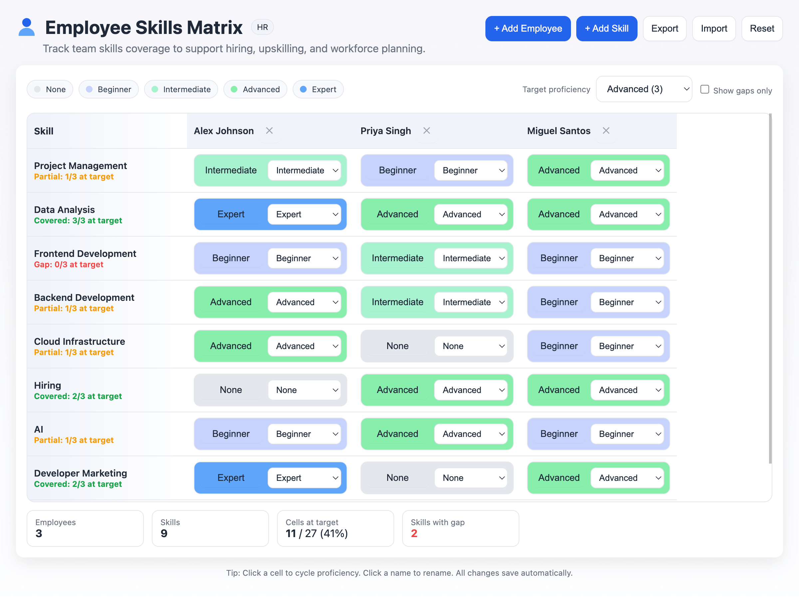
</div>

**Prompt：**
```
Create a single-page app in a single HTML file with the following requirements:
- Name: Employee Skills Matrix
- Goal: Track team skills coverage.
- Features: Skill list vs. employee grid, proficiency levels.
- The UI should be HR-focused.
```

<a id="prompt-5"></a>
## 案例 5：客户旅程流程图
<div style="display: flex; justify-content: space-between;">
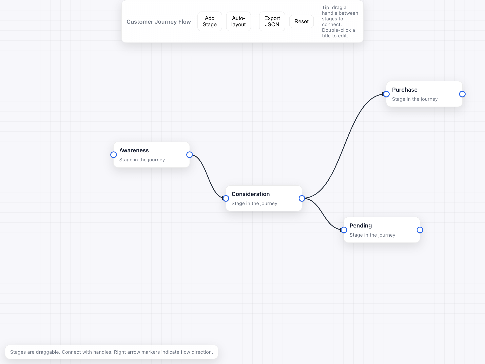
</div>

**Prompt：**
```
Create a single-page app in a single HTML file with the following requirements:
- Name: Customer Journey Flow
- Goal: Visualize a customer’s steps from awareness to purchase.
- Features: Editable stages, drag-and-drop connections.
- The UI should be clean and diagram-like.
```

<a id="prompt-4"></a>
## 案例 4：客户案例研究
<div style="display: flex; justify-content: space-between;">
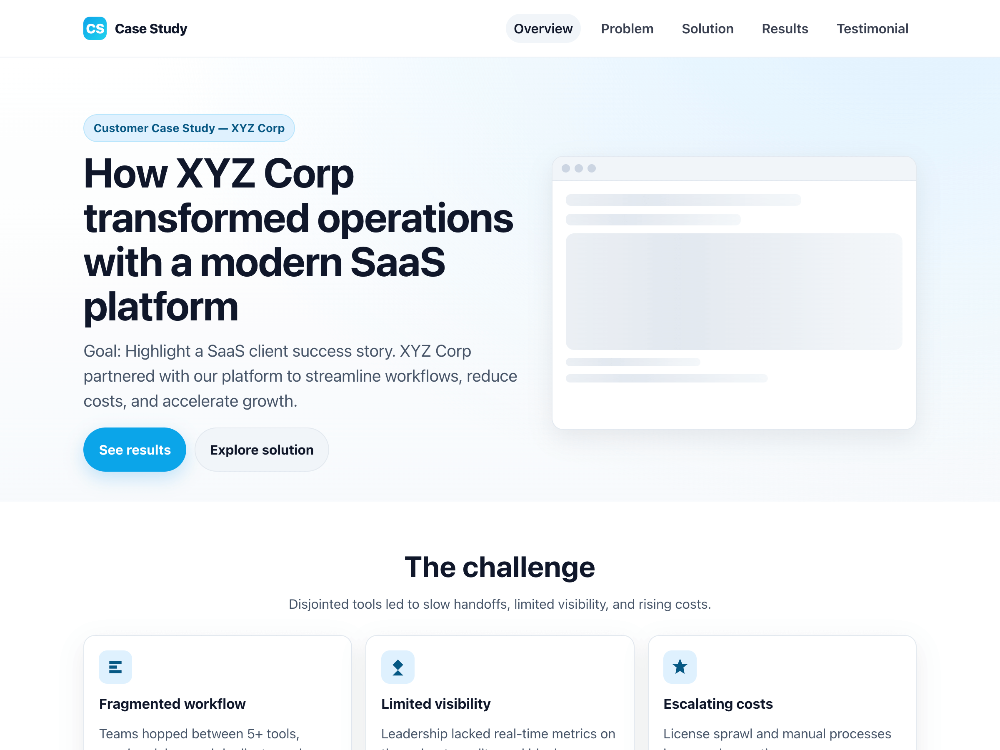
</div>

**Prompt：**
```
Create a single-page app in a single HTML file with the following requirements:
- Name: Customer Case Study - XYZ Corp
- Goal: Highlight a SaaS lient success story.
- Features: Problem/solution breakdown, metrics, testimonial quote.
- The UI should be clean and persuasive.
```

<a id="prompt-3"></a>
## 案例 3：CSV转图表工具
<div style="display: flex; justify-content: space-between;">
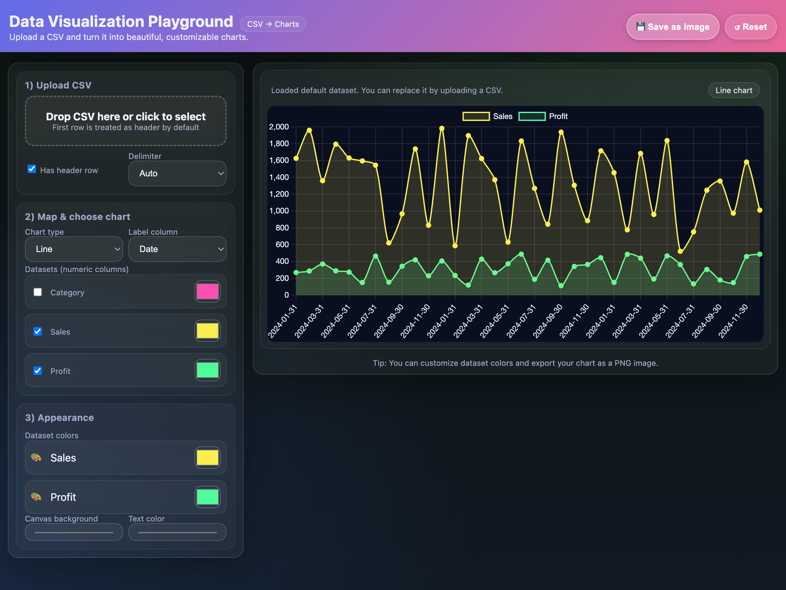
</div>

**Prompt：**
```
Create a single-page app in a single HTML file with the following requirements:
- Name: Data Visualization Playground
- Goal: Upload CSV and generate charts.
- Features: Chart type selector, color customization, save as image.
- The UI should be modern with a focus on charts.
```

<a id="prompt-2"></a>
## 案例 2：公司缩写列表
<div style="display: flex; justify-content: space-between;">
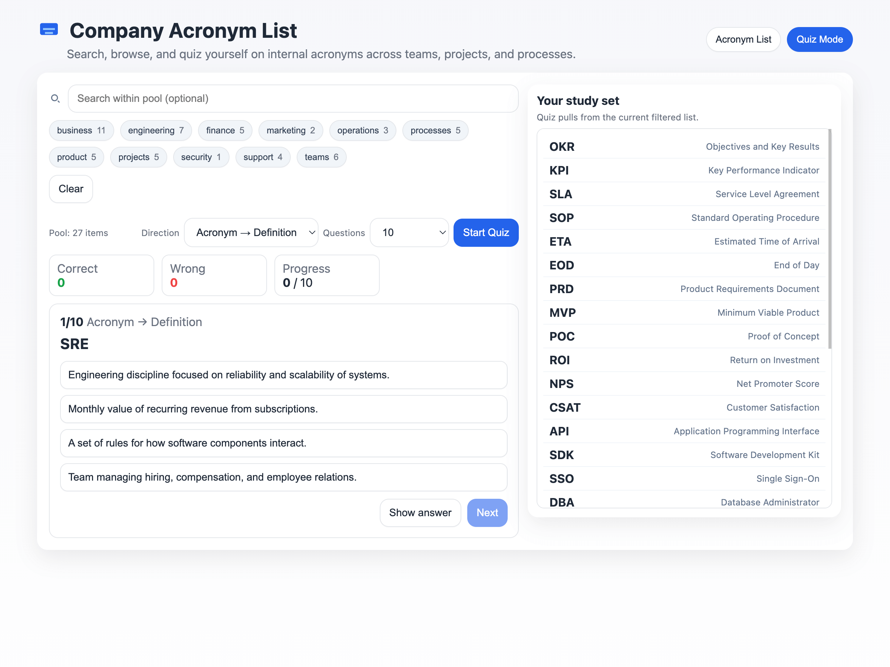
</div>

**Prompt：**
```
Create a single-page app in a single HTML file with the following requirements:
- Name: Company Acronym List
- Goal: Help users learn and remember internal company acronyms.
- Features: Search bar to look up acronyms, list view with definitions, category tags (e.g., teams, projects, processes), and a quiz mode to test knowledge.
- The UI should be clean, professional, and easy to navigate, with a responsive layout for both desktop and mobile.
```

<a id="prompt-1"></a>
## 案例 1：颜色匹配挑战游戏
<div style="display: flex; justify-content: space-between;">
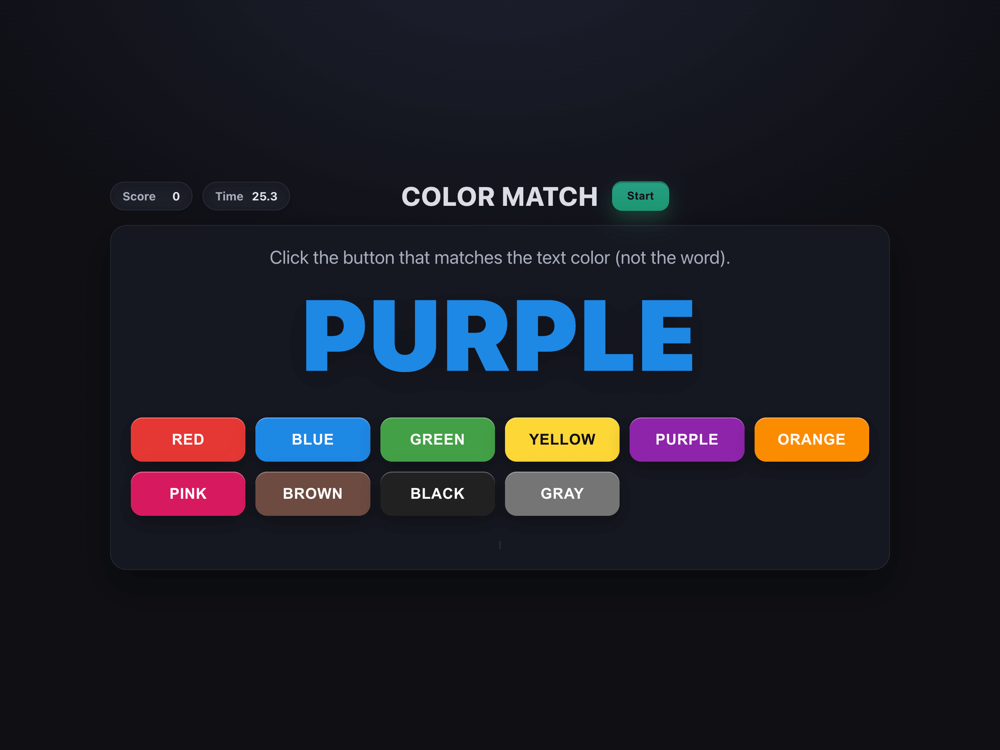
</div>

**Prompt：**
```
Create a single-page app in a single HTML file for a fast-paced “color match” game.
- Show a word (e.g., “RED”) in a random font color — player must click the correct color button (not the word meaning).
- Keep score based on correct answers within 30 seconds.
- Use large typography, color-coded buttons, and smooth button press animations.
```